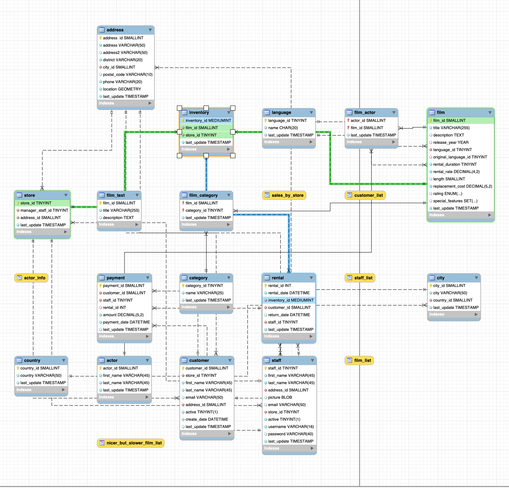

# bda-modulo-2-evaluacion-final-cbueno82

Script de   para la base de datos Sakila

### Descripción

Script completo con veinticinco consultas sobre la base de datos de ejemplo Sakila. Se incluye un bonus con retos adicionales y casos más complejos.
La base de datos Sakila simula la de un videoclub e incluye datos sobre películas, actores, clientes, alquileres, categorías, etc.

### Arvhivos añadidos
- 'sakila_queries.sql'

### Requisitos
- MySQL Server instalado
- Base de datos Sakila correctamente importada
- Cliente MySQL (WorkBench, por ejemplo)

### Conceptos de MySQL tratados
- SELECT, DISTINCT, WHERE, LIKE, REGEXP
- JOIN (INNER y LEFT)
- GROUP BY, ORDER BY, HAVING
- Subconsultas
- Funciones agregadas: COUNT(), AVG(), DATEDIFF(), etc
- Alias y ORDER BY

### Diagrama EER de la base de datos
A continuación, se muestran dos capturas del diagrama EER de la base de datos, de interés en la aplicación de JOINS y subconsultas.

- Una primera imagen general:

- Una segunda imagen de una de las conexiones posibles:

### Notas
- Varias de las consultas incluyen comentarios relevantes sobre el uso, propósito o elementos técnicos.
- En algunos casos se muestran diferentes alternativas para resolver un mismo ejercicio.